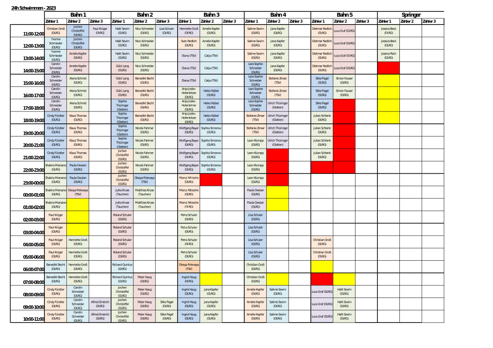

# 24-Stunden-Schwimmen 2023

**Datum:** 11.11 bis 12.11

**Zeit:** 11 Uhr bis 11 Uhr

# Wichtige Themen und Fragen
1. [Jugenschutz](#jugenschutz)
2. [Eintritt](#eintritt)
3. [Öffnungszeiten](#öffnungszeiten)
4. [Verpflegung](#verpflegung)
5. [Schnuppertauchen](#schnuppertauchen)

## Planung

## Jugenschutz
Das Pano hat mit dem Jugendamt eine Vereinbarung getroffen. Für Jugendliche **unter 18 Jahre** ist
eine Teilnahme am 24-Stunden-Schwimmen durchgehend möglich. Einzige Voraussetzung ist eine
ausgefüllte Einverständniserklärung.

Link zur [Einverständniserklärung](https://www.panorama-bad.de/content/8-events/3-24h-schwimmen-2023/einverstaendniserklaerung-24-stunden-schwimmen.pdf)

## Eintritt
Der Eintritt ist für Helfer des 24-Stunden-Schwimmen kostenlos. Hierfür wird an der Kasse eine
Helfer-Liste hinterlegt.

Für normale Besucher gilt folgende Regelung:
- Bei Lösen einer Tageskarte: Das Bad kann in den zwei Tagen beliebig oft betreten/verlassen werden.
- Bei Lösen einer 1 h 45 min oder 3 Stunden Karte: Das Bad muss innerhalb dieser Zeit wieder verlassen werden, ein erneuter Eintritt ist kostenpflichtig.

## Öffnungszeiten
- Der Vitalbereich ist regulär bis 21 Uhr geöffnet.
- Die Saunalandschaft ist durchgehend geöffnet (Saunieren nonstop samstags und sonntags).
- Das Restaurant & Café ist samstags bis 22:30 Uhr geöffnet. Sonntags ist es ab 9:30 Uhr geöffnet.

## Verpflegung
Für die Helfer wird es Essensgutscheine für das Pano-Restaurant geben.

Getränke werden vom Pano gestellt (~ 3 Flaschen pro Helfer)

Am Sonntag haben wir im Pano auf 11:45 Uhr zwei Tische reserviert (ca. 16 Plätze) :) 

## Schnuppertauchen 
Der Tauchsportclub Delphin bietet am Samstagnachmittag ein Schnuppertauchen von 14-16 Uhr an.
